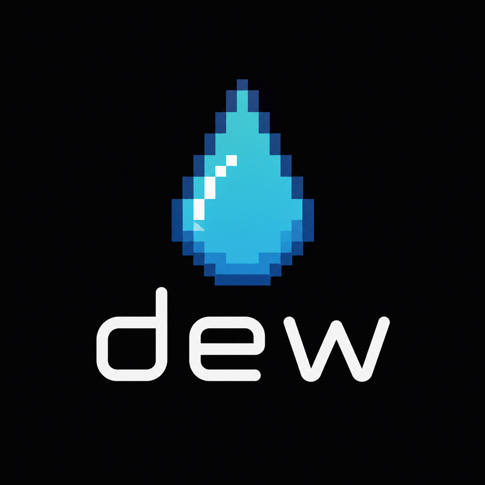
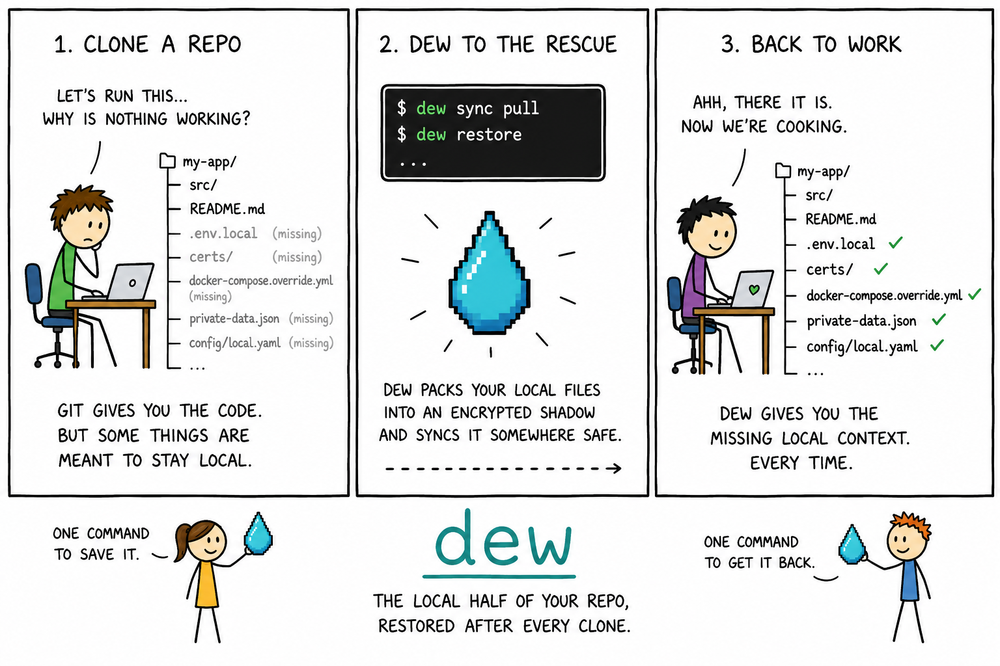
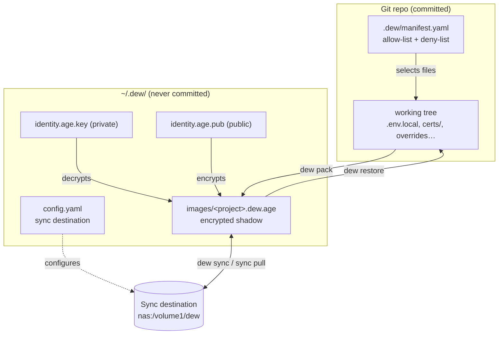
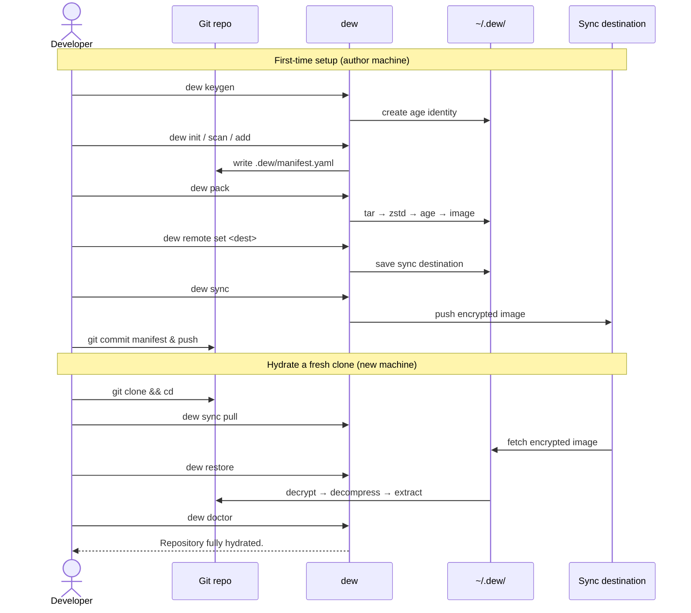

<p align="center">
  
</p>

<p align="center">
  <em>the local half of your repo, restored after every clone.</em>
</p>

<p align="center">
  <a href="https://vedanta.github.io/dew/"></a>
  <a href="LICENSE"></a>
</p>

<p align="center"><a href="https://vedanta.github.io/dew/"><strong>vedanta.github.io/dew</strong></a></p>

**dew** is a local-first CLI that manages the *private* repository state Git intentionally ignores: `.env.local`, dev certificates, `docker-compose.override.yml`, private fixtures, local config — the per-developer files needed to actually run a clone.

Git tracks shared project state. dew tracks the local-only files that make a cloned repo work. It packages an allow-listed set of files into a single encrypted image per repo and can sync that image to a remote, so a fresh clone can be **hydrated** back to a working state.

```bash
git clone <repo> && cd <repo>
dew sync pull   # fetch the encrypted image
dew restore     # extract local files back into the working tree
```

Git gives you the code. dew gives you the missing local context.

<p align="center">
  
</p>

## What dew is not

dew is **not** a secrets manager, a backup tool, Git LFS, or a cloud sync service. It is a repo-aware local context manager for files that Git intentionally ignores. Sync copies encrypted images only — never private keys.

## How it works

dew uses a **two-location model**:

- **In the repo (committed to Git):** `.dew/manifest.yaml` declares the project name, image name, and an allow-list (plus an optional `deny:` list). It never contains secrets, file contents, or keys.
- **In your home (never committed):** `~/.dew/` holds `config.yaml`, a single global `age` keypair, and `images/<project>.dew.age` — the encrypted shadow image(s).

There is **one global identity** shared across all repos and **one encrypted image per repo**.

### Architecture



### Packaging pipeline

```
Pack:    allow-listed files → tar → zstd → age encrypt → ~/.dew/images/<project>.dew.age
Restore: image → age decrypt → zstd decompress → tar extract → write into repo
```

The allow-list is authoritative — `pack` only ever includes paths the manifest lists, never "everything ignored." A three-layer deny-list keeps noise out: **built-in** patterns (`node_modules/`, `dist/`, `*.log`, …), a **global** `deny:` in `~/.dew/config.yaml` (your per-user noise, applied to every repo), and the **repo** `deny:` in the manifest. `dew rules` shows all three. `.gitignore` is only a hint for discovery.

### Workflow



## Commands

```bash
# Identity
dew keygen                      # create the global age identity
dew key status                  # inspect identity
dew key push <user@host>        # provision your identity onto another machine (SSH)

# Repository setup
dew init [--from-gitignore] [--project <name>]   # create .dew/manifest.yaml

# Discovery
dew scan                        # suggest candidate local files
dew rules                       # show effective allow / deny (built-in, global, repo)

# Manifest
dew add <path> | add .          # add file/dir/discovered candidates
dew remove <path> | list        # edit / view the allow-list

# Image lifecycle
dew pack | restore              # build / extract the encrypted image
                                #   --dry-run on either to preview without writing
                                #   'dew hydrate' is an alias for restore

# Health
dew status | doctor             # validate hydration state (current repo)
dew images                      # list all images dew manages (global)

# Sync
dew remote set <dest>           # set the sync destination (also: remote, remote unset)
dew remote test                 # check it's reachable / trusted / writable
dew remote images               # list the images stored at the destination
dew sync | sync pull            # push / pull the encrypted image
```

## Example end-to-end flow

```bash
# One-time setup
dew keygen

# In a repo
cd myrepo
dew init
dew scan
dew add .env.local
dew add docker-compose.override.yml
dew pack
git add .dew/manifest.yaml && git commit -m "Add dew manifest" && git push

dew remote set nas:/volume1/dew   # one-time: where images sync (shared across repos)
dew remote test                   # optional: confirm it's reachable & writable
dew sync

# Get your identity onto the new machine (one-time, over SSH)
dew key push you@newmachine        # run from the machine that has the identity

# On the new machine
git clone <repo> && cd myrepo
dew sync pull
dew restore
dew doctor   # → Repository fully hydrated.
```

## Documentation

- **[Website](https://vedanta.github.io/dew/)** — the product page (install, overview, demo).
- **[User manual](docs/USER-MANUAL.md)** — concepts, getting started, workflows, security, troubleshooting.
- **[Command reference](docs/COMMANDS.md)** — every command and flag.
- **[Design spec](docs/design.md)** — the MVP design and rationale.
- **[Build plan](docs/build-plan.md)** & **[build log](docs/BUILDLOG.md)** — how it was planned and built.
- **[Manual test plan](docs/manual-test-plan.md)** — end-to-end verification walkthrough.

## Install

dew is a single self-contained binary (Linux / macOS / Windows, amd64 & arm64).

**Homebrew** (macOS):
```bash
brew install --cask vedanta/dew/dew
# or: brew tap vedanta/dew && brew install --cask dew
```

**Download a binary** from the [latest release](https://github.com/vedanta/dew/releases/latest) — pick your OS/arch, then:
```bash
tar -xzf dew_*_<os>_<arch>.tar.gz
sudo mv dew /usr/local/bin/      # Windows: extract the .zip and add it to PATH
```
Verify the download against `checksums.txt`. On macOS the binary isn't notarized yet, so Gatekeeper may warn — `xattr -d com.apple.quarantine ./dew` (or right-click → Open). Homebrew installs avoid this.

**With Go** (1.26+):
```bash
go install github.com/vedanta/dew@latest
```

Then check it works:
```bash
dew version
```

## Status

**The MVP is complete and working.** Every command above is implemented and tested — Go unit tests plus binary-level acceptance tests, gated on a cross-platform (Linux/macOS/Windows) CI matrix.

### Releasing

Releases are cut by pushing a version tag; [GoReleaser](https://goreleaser.com)
builds the cross-platform binaries (linux/macOS/windows × amd64/arm64),
generates checksums, and publishes a GitHub Release:

```bash
git tag v0.2.0 && git push origin v0.2.0
```

The release workflow injects the version, commit, and date (visible via
`dew version`). Validate the config locally with `goreleaser release --snapshot --clean`.
(macOS binaries are not yet notarized — Gatekeeper may warn on direct download.)

## Building from source

Requires **Go 1.26+**.

```bash
git clone https://github.com/vedanta/dew && cd dew
go build -o dew .      # or: make build
./dew --help
```

Run the checks the way CI does:

```bash
make check        # gofmt + go vet + golangci-lint + go test -race
make acceptance   # build the binary and run the acceptance suite
make e2e          # full two-machine end-to-end test (test/e2e.sh)
```

dew is a **single self-contained binary**: encryption and compression are pure Go (no external tools). The only external runtime dependencies are OpenSSH's `scp` (syncing to a remote `host:path`) and `ssh` (`dew remote test` against a remote) — both ship together, and only remote destinations need them; local or mounted destinations need nothing. `$DEW_HOME` overrides the default `~/.dew` location.

## Tech

Go single binary · [Cobra](https://github.com/spf13/cobra) (CLI) · `gopkg.in/yaml.v3` (config + manifest) · `archive/tar` · native [age](https://github.com/FiloSottile/age) encryption via [`filippo.io/age`](https://pkg.go.dev/filippo.io/age) · pure-Go [zstd](https://github.com/klauspost/compress) · `scp`/`ssh` for remote sync and checks (inherits your SSH config).

## License

Licensed under the [Apache License 2.0](LICENSE).
