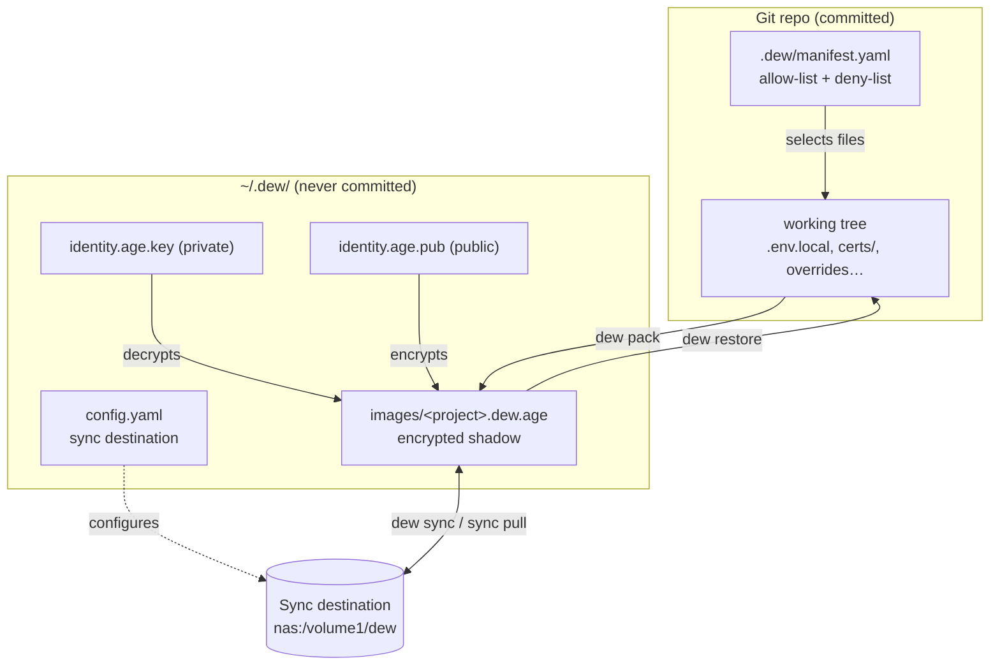
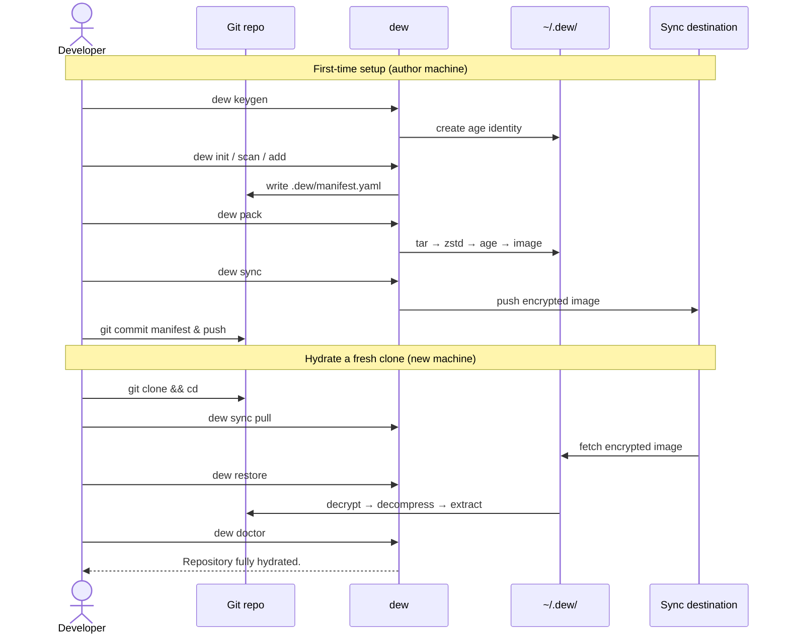

# dew

> dew — the local half of your repo, restored after every clone.

**dew** is a local-first CLI that manages the *private* repository state Git intentionally ignores: `.env.local`, dev certificates, `docker-compose.override.yml`, private fixtures, local config — the per-developer files needed to actually run a clone.

Git tracks shared project state. dew tracks the local-only files that make a cloned repo work. It packages an allow-listed set of files into a single encrypted image per repo and can sync that image to a remote, so a fresh clone can be **hydrated** back to a working state.

```bash
git clone <repo> && cd <repo>
dew sync pull   # fetch the encrypted image
dew restore     # extract local files back into the working tree
```

Git gives you the code. dew gives you the missing local context.

## What dew is not

dew is **not** a secrets manager, a backup tool, Git LFS, or a cloud sync service. It is a repo-aware local context manager for files that Git intentionally ignores. Sync copies encrypted images only — never private keys.

## How it works

dew uses a **two-location model**:

- **In the repo (committed to Git):** `.dew/manifest.yaml` declares the project name, image name, and an allow-list (plus an optional `deny:` list). It never contains secrets, file contents, or keys.
- **In your home (never committed):** `~/.dew/` holds `config.yaml`, a single global `age` keypair, and `images/<project>.dew.age` — the encrypted shadow image(s).

There is **one global identity** shared across all repos and **one encrypted image per repo**.

### Architecture



### Packaging pipeline

```
Pack:    allow-listed files → tar → zstd → age encrypt → ~/.dew/images/<project>.dew.age
Restore: image → age decrypt → zstd decompress → tar extract → write into repo
```

The allow-list is authoritative — `pack` only ever includes paths the manifest lists, never "everything ignored." A deny-list (built-in patterns + per-manifest `deny:`) keeps noise like `node_modules/`, `dist/`, and `*.log` out. `.gitignore` is only a hint for discovery.

### Workflow



## Command set (MVP)

```bash
# Identity
dew keygen                      # create the global age identity
dew key status                  # inspect identity

# Repository setup
dew init [--from-gitignore]     # create .dew/manifest.yaml

# Discovery
dew scan                        # suggest candidate local files

# Manifest
dew add <path> | add .          # add file/dir/discovered candidates
dew remove <path> | list        # edit / view the allow-list

# Image lifecycle
dew pack | restore              # build / extract the encrypted image

# Health
dew status | doctor             # validate hydration state

# Sync
dew sync | sync pull            # push / pull the encrypted image
```

## Example end-to-end flow

```bash
# One-time setup
dew keygen

# In a repo
cd myrepo
dew init
dew scan
dew add .env.local
dew add docker-compose.override.yml
dew pack
git add .dew/manifest.yaml && git commit -m "Add dew manifest" && git push
dew sync

# On a new machine
git clone <repo> && cd myrepo
dew sync pull
dew restore
dew doctor   # → Repository fully hydrated.
```

## Status

This repository currently contains the design spec only — implementation has not started. The authoritative MVP spec is [`docs/design.md`](docs/design.md).

## Tech

Go single binary · [Cobra](https://github.com/spf13/cobra) · `gopkg.in/yaml.v3` · `archive/tar` · zstd · [age](https://github.com/FiloSottile/age) · scp/rsync.
