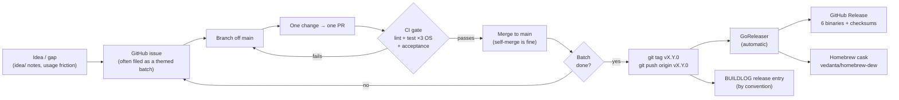
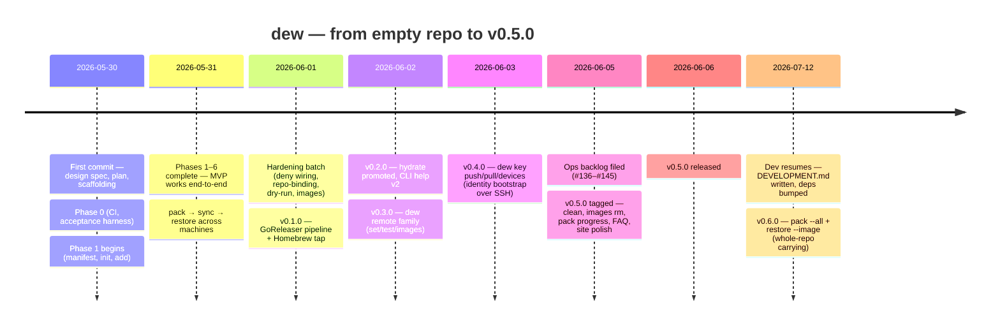
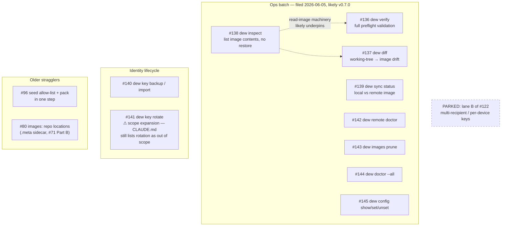

# Development — process, history, and where things stand

This is the re-entry document: read it (plus the tail of
[`BUILDLOG.md`](BUILDLOG.md)) when returning to dew after time away. It records
how development actually flows — GitHub issues, batches, PRs, releases,
versioning — what has shipped so far, and where the project currently sits.

The history here is a snapshot (**last updated: 2026-07-12, at v0.6.0**). The
live sources of truth are always:

```bash
gh issue list                 # the backlog
gh release list               # what has shipped
git log --oneline -20         # what happened most recently
```

## Where things stand

- **The product is complete and shipped.** The MVP works end-to-end across
  machines, plus six tagged releases of hardening and new command surfaces.
- `main` is at `v0.6.0` (whole-repo carrying: `pack --all` +
  `restore --image`). Working tree clean, CI green.
- **12 open issues**, all enhancements, no bugs — see
  [the backlog map](#the-backlog-as-of-v060) below. Eight of them were filed
  together as a deliberate "ops" batch and read as the raw material for a
  v0.7.0.
- One design thread is deliberately **parked**: lane B of #122 (multiple
  recipients / per-device keys). v0.4.0 shipped lane A (carry the key) instead.

## The development flow

Everything moves through the same loop, whether it's a one-line fix or a new
command family:



The rules that make it work:

- **One change → one PR → `main`.** `main` is branch-protected: PR required,
  all checks must pass, enforced on admins too. Self-merge is fine.
- **CI is the gate; run it locally first:** `make check` (gofmt -s, go vet,
  golangci-lint incl. gosec, `go test -race`) and `make acceptance` (build the
  binary, drive it with shell scripts in an isolated `$HOME`).
- **The CI matrix is Linux/macOS/Windows** — watch for Windows path and
  permission differences. Acceptance scripts run on Unix only.
- Docs move with code: command help follows [`help-style.md`](help-style.md),
  and [`USER-MANUAL.md`](USER-MANUAL.md) / [`COMMANDS.md`](COMMANDS.md) are
  updated in the same PR that changes behavior.

## How GitHub issues are used

Issues and PRs share one number sequence, so gaps in issue numbers are PRs.
`#123` in a commit subject is usually the PR, not an issue.

**During the MVP** (May 30–31), issues were pre-planned in
[`build-plan.md`](build-plan.md): milestones **Phase 0–6** (setup → manifest →
identity → pack/restore → discovery → health → sync), 27 issues, each labeled
`phase-N` plus area labels. All are closed; the milestones remain as the record
of that structure.

**After the MVP**, milestones were dropped in favor of two patterns:

1. **Themed batches.** A coherent wave of issues is filed together, implemented
   as consecutive PRs, and becomes the next minor release. This is the core
   rhythm of the project:
   - #108–#110 under umbrella #111 (`dew remote` family) → **v0.3.0**
   - #122 (design issue with lanes A/B; implementation PRs #123–#125) → **v0.4.0**
   - #155–#157 (whole-repo carrying, PRs #158–#160) → **v0.6.0**
   - #136–#145 (the "ops" + "identity" batch) → *filed, unimplemented — the
     likely v0.7.0*
2. **Umbrella / part-split issues.** A larger idea gets a parent issue holding
   the design decision, with children (issues or PRs) doing the work. When only
   half ships, the remainder gets its own follow-up (e.g. #71 Part A shipped
   `dew images`; #80 is Part B, the `.meta` sidecar).

Labels are area tags (`cli`, `security`, `sync`, `identity`, `health`,
`discovery`, `manifest`, `packaging`, `ops`, `ci`) plus `enhancement`;
post-MVP batches lean on `ops` and `identity`.

## Release process and versioning

Cutting a release is **one command** — everything downstream is automated:

```bash
git tag v0.7.0 && git push origin v0.7.0
```

That triggers `.github/workflows/release.yml` → GoReleaser
(`.goreleaser.yaml`), which builds six static binaries (linux/macOS/windows ×
amd64/arm64) with version/commit/date stamped into `dew version`, packages
archives + `checksums.txt`, publishes the GitHub Release with a changelog from
PR titles (excluding `docs:`/`test:`/`chore:`/`site:`/`ci:`), and pushes the
updated Homebrew cask to `vedanta/homebrew-dew`. Validate the config locally
with `goreleaser release --snapshot --clean`.

Versioning conventions (as practiced so far):

- **SemVer, pre-1.0.** Every release to date is a **minor** bump.
- **A minor = a completed batch** — typically a new command surface or a
  coherent set of UX/hardening changes. No breaking changes have shipped.
- **Patch releases are unused so far**; they'd be for a bug fix outside a batch.
- By convention, each release also gets a narrative entry in the
  [`BUILDLOG.md`](BUILDLOG.md) "Releases & distribution" section — that entry
  is the changelog with reasoning attached, and it's what future-you reads
  first.

## Historical progress

The whole project, from first commit to the current release, took one week of
calendar time (~164 commits):



| Release | Date | Theme | Trail |
|---|---|---|---|
| v0.1.0 | 2026-06-01 | Distribution: GoReleaser pipeline, Homebrew cask, `dew version` stamping | #74 |
| v0.2.0 | 2026-06-02 | Polish: `hydrate` first-class, `ls`/`rm` aliases, CLI help v2 rewrite | — |
| v0.3.0 | 2026-06-02 | `dew remote` family: CLI-managed sync destination + `test`/`images` | #111 (#108–#110) |
| v0.4.0 | 2026-06-03 | `dew key push`/`pull`/`devices`: guarded identity bootstrap over SSH | #122 (PRs #123–#125) |
| v0.5.0 | 2026-06-06 | Lifecycle & UX: `dew clean`, `images rm`, pack progress bar, FAQ, site | #135, #134, #146 |
| v0.6.0 | 2026-07-12 | Whole-repo carrying: `pack --all`, `restore --image`, deny built-ins extended | #155–#157 (PRs #158–#160) |

For the full narrative — what was decided and why at each step — read
[`BUILDLOG.md`](BUILDLOG.md) top to bottom; it was written as the work
happened.

## The backlog (as of v0.6.0)

Twelve open issues in three clusters:



Notes for whoever picks this up (probably you):

- Within the ops batch, **#138 `inspect` is the natural first ticket** — #136
  `verify` and #137 `diff` both need to read image contents without restoring.
  #136/#137/#138/#139 share one theme: *"what's in my image and is it
  current?"* — a coherent v0.7.0.
- **#143 `images prune` partially overlaps `dew images rm`** (shipped in
  v0.5.0, after the issue was filed) — trim its scope before starting.
- **#141 `key rotate` implies a scope decision**, not just code: rotation is
  currently listed as out of scope in `CLAUDE.md` and the design spec. Decide
  deliberately, then update those docs in the same batch.

## Picking development back up

1. **Re-orient:** `git pull`, then `gh issue list` and the tail of
   [`BUILDLOG.md`](BUILDLOG.md). Skim this file's backlog map and check whether
   it still matches reality.
2. **Verify the toolchain still works:** `make check && make acceptance`
   (and `go build -o dew . && ./dew version`).
3. **Pick a batch, not a ticket.** The project's rhythm is: choose a theme,
   file/groom the issues (umbrella if there's a design decision), then one PR
   per child until the batch is done.
4. **Ship it:** tag the minor, let GoReleaser do the rest, write the BUILDLOG
   release entry, and update the "last updated" line at the top of this file.
